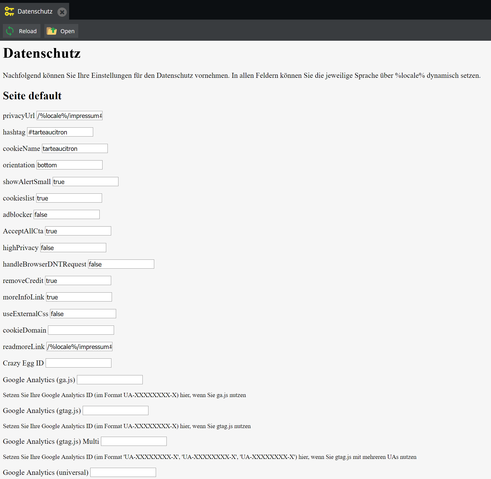
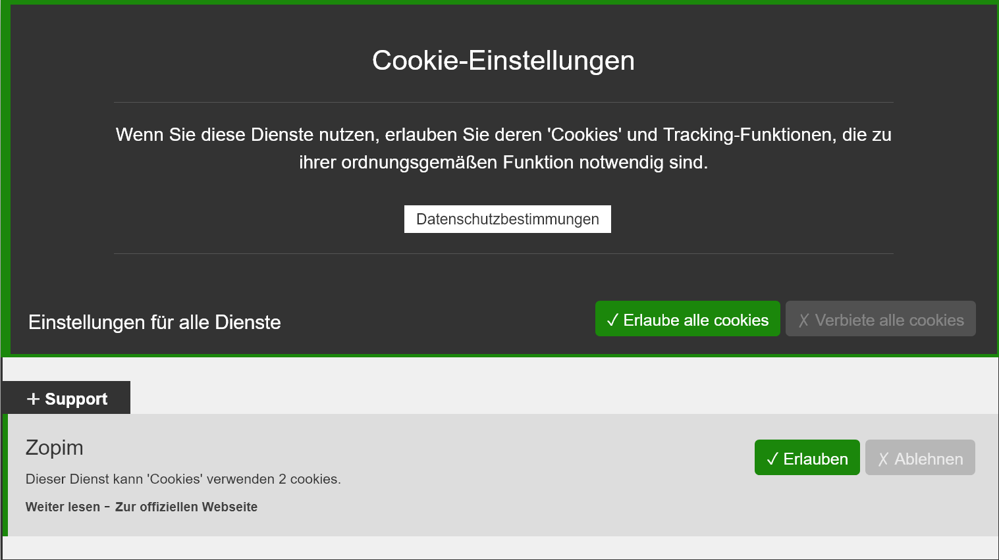

# Dataprivacy Bundle for Pimcore
Add dataprivacy features (GDPR / DSGVO) to Pimcore

## Features
* Does support multiple domains (using Pimcore sites)
* Easy installation in pimcore projects (drop-in-solution)
* Admin interface to configure trackers and tools
* Frontend with cookie and tracking consent features



## Dependencies
This bundle does include the great script [tarteaucitron.js](https://github.com/AmauriC/tarteaucitron.js) in the `pringuin/DataprivacyBundle/Resources/public/js/tarteaucitron` folder. 

## Installation

### Composer Installation
1. Add code below to your `composer.json` or install it via command line

```json
"require": {
    "pringuin/dataprivacybundle" : "dev-master"
}
```

### Installation via Extension Manager
After you have installed the Dataprivacy Bundle via composer, open the pimcore administration backend and go to `Tools` => `Extension`:
- Click the green `+` Button in `Enable / Disable` row
- Click the green `+` Button in `Install/Uninstall` row

### Installation via CommandLine
After you have installed the Dataprivacy Bundle via composer:
- Execute: `$ bin/console pimcore:bundle:enable pringuinDataprivacyBundle`
- Execute: `$ bin/console pimcore:bundle:install pringuinDataprivacyBundle`

### Configure trackers, tools and services
The backend configuration should now be available. below the search in your pimcore admin backend.
You can set your tracking IDs (for example your UA-XXXXXXXX-X) there.
This will generate files in the folder `PIMCOREINSTALLATION/app/config/pringuin_dataprivacy`.
The file for the default site will be `siteconfig_default.yml`
The next sites will follow the pimcore IDs and look like `siteconfig_1.yml`, `siteconfig_2.yml`.
You can also change these files directly using your favorite IDE. They can be archived using git.

### Installation into your template
To include the cookie consent into your frontend layout, you can use the following twig code. Simply insert it into your template (e.g. layout.html.twig) before the closing body Tag:
```twig
{{ pimcore_action('default', 'default', 'pringuinDataprivacyBundle', {}) }}
```
Hint: You can always override this template by implementing your own template in the folder `PIMCOREINSTALLATION/app/Resources/pringuinDataprivacyBundle/views/default/default.html.twig`



## Supported Tackers and Tools
This package does currently ship with the following trackers/tools integrations:
- Crazy Egg
- eKomi
- eTracker
- Facebook Pixel
- Google Analytics (supporting different implementations)
- Google Adwords Remarketing
- Google Fonts
- Google Tag Manager
- Hubspot
- Matomo (formerly Piwik)
- Mautic
- Zopim

### Add your own tracker or tool consent
If a tracker or tool is missing, please check if the tool is integrated into [tarteaucitron.js](https://github.com/AmauriC/tarteaucitron.js) first.
You can do this using the source code or the official [tarteaucitron.js website](https://opt-out.ferank.eu/en/install/) using the installation guide.

If the tracker or tool **is not** included into the tarteaucitron.js package, please integrate it there first (they accept pull requests).
Alternatively you can directly include your custom service using this example code from tarteaucitron.js:
```js
tarteaucitron.services.mycustomservice = {
  "key": "mycustomservice",
  "type": "social|analytic|ads|video|support",
  "name": "MyCustomService",
  "needConsent": true,
  "cookies": ['cookie', 'cookie2'],
  "readmoreLink": "/custom_read_more", // If you want to change readmore link
  "js": function () {
    "use strict";
    // When user allow cookie
  },
  "fallback": function () {
    "use strict";
    // when use deny cookie
  }
};
```

To get a tracker or tool which **is** included in the tarteaucitron.js package into this bundle, you'll have to do the following steps:
#### Add it to the default configuration
The default configuration is the base for all site specific configurations. Changes to the default configuration will also change your configuration files for the sites.
The default configuration is located at Resources/var/defaultconfiguration.yml

#### Add the view output
The necessary code for the templates can be found in the [tarteaucitron.js installation instructions](https://opt-out.ferank.eu/en/install/) easily.
Simply select Free manual installation and scroll down to the next step. Search for your service to get the installation code, typically looking like this:
```html
<script type="text/javascript">
    tarteaucitron.user.etracker = 'data-secure-code';
    (tarteaucitron.job = tarteaucitron.job || []).push('etracker');
</script>
```
Add it to the other codes in the `Resources/views/default/default.html.twig` file and replace dynamic parameters like the data-secude-code above with twig values as shown in the currently implemented trackers and tools.


#### Add a translation
Finally add a backend translation entry in the file `Resources/translations/admin.en.yml` and/or `admin.de.yml`
The key will be the same you used in the `defaultconfiguration.yml`.
You can also append a `_helptext` to the key to insert a custom helptext for editors.

#### Final step
Test your implementation and please create a pull request in this repository so everybody can now use your newly implemented service, tracker or tool.
Thanks!

## Contributing
While we consider this bundle stable and ready for productive use, we'd be very happy if you'd support us and the whole pimcore community by improving this bundle with pull requests. This is our first public pimcore bundle so constructive feedback would be very welcome aswell!

## Copyright and license
Copyright: [PRinguin GbR](https://pringuin.de)  
For licensing details please visit [LICENSE.md](LICENSE.md)  
